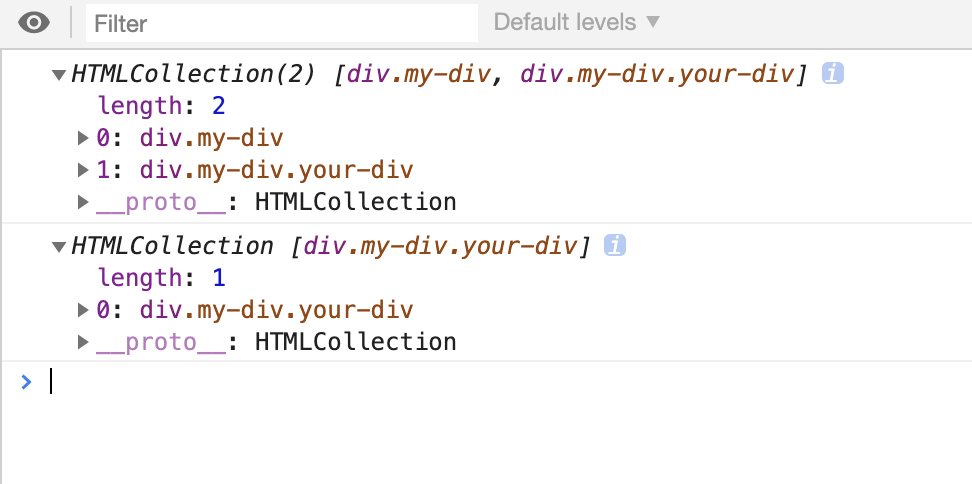
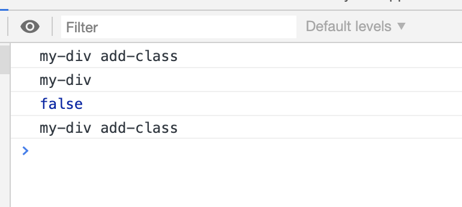
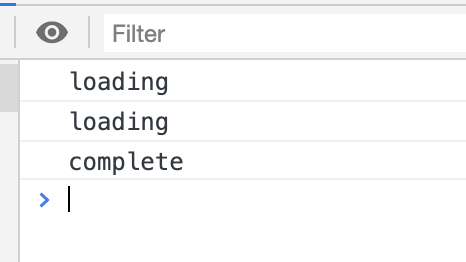
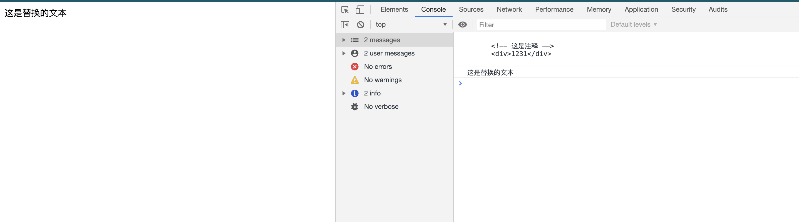
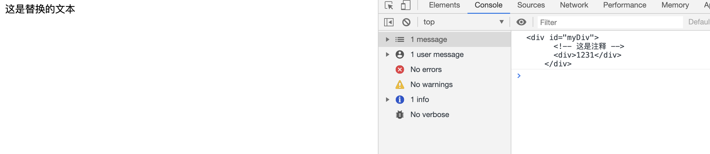
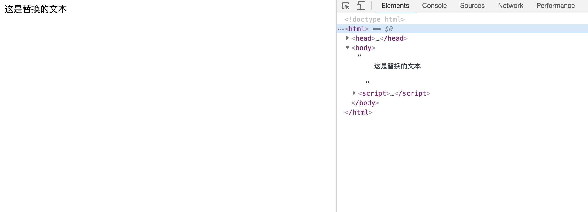

# DOM扩展之HTML5

[TOC]

### 介绍

HTML5 规范围绕如何使用新增标记定义了大量 JavaScript API。其中一些 API 与 DOM 重叠， 定义了浏览器应该支持的 DOM 扩展。

### 与类相关的扩展

- ### `getElementsByClassName()` 方法

  `getElementsByClassName()` 方法接收一个参数，即一个包含一或多个类名的字符串，返回带有指定类的所有元素的 `NodeList` 。传入多个类名时，类名的先后顺序不重要。

  ```html
  <!DOCTYPE html>
  <html>
    <head>
      <title>Document</title>
    </head>
    <body>
      <div class="my-div"></div>
      <div class="my-div your-div"></div>
    </body>
    <script>
      var allMyDiv = document.getElementsByClassName('my-div'); // 取得所有类中包含"my-div"元素
      var allOtherDiv = document.getElementsByClassName('my-div your-div'); // 取得所有类中包含"my-div"和"your-div"的元素，类名不分先后
      console.log(allMyDiv);
      console.log(allOtherDiv);
    </script>
  </html>
  ```

  打印结果如下：

  

- ### `classList` 属性

  `classList` 属性是 HTML5 新增的一种更简单更安全的操作类名的方式。这个 `classList` 属性是新集合类型 `DOMTokenList` 的实例。与其他 DOM 集合类似，`DOMTokenList` 有一个表示自己包含多少元素的 `length` 属性，而要取得每个元素可以使用 `item()` 方法，也可以使用方括号语法。
  此外，此类型还定义了如下几个方法：

  | 方法名            | 描述                                                         |
  | ----------------- | ------------------------------------------------------------ |
  | `add(value)`      | 将给定的字符串值添加到列表中。如果值已经存在，则不添加。     |
  | `contains(value)` | 表示列表中是否存在给定的值，如果存在则返回 true，否则返回 false。 |
  | `remove(value)`   | 从列表中删除给定的字符串。                                   |
  | `toggle(value)`   | 如果列表中已经存在给定的值，删除它;如果列表中没有给定的值，添加它。 |

  ```html
  <!DOCTYPE html>
  <html>
    <head>
      <title>Document</title>
    </head>
    <body>
      <div class="my-div"></div>
      <div class="my-div your-div"></div>
    </body>
    <script>
      var myDiv = document.getElementsByClassName('my-div')[0]; // 取得所有类中包含"my-div"元素
      // 增加"add-class"类名
      myDiv.classList.add('add-class');
      console.log(myDiv.className); // "my-div add-class"
      // 移除"add-class"类名
      myDiv.classList.remove('add-class');
      console.log(myDiv.className); // "my-div"
      // 是否包含"add-class"类名
      console.log(myDiv.classList.contains('add-class')); // false
      // toggle"add-class"类名
      myDiv.classList.toggle('add-class');
      console.log(myDiv.className); // "my-div add-class"
    </script>
  </html>
  ```

  打印结果如下：

  

### 焦点 管理

- ### `document.activeElement` 属性

  这个属性始终会引用 DOM 中当前获得了焦点的元素。元素获得焦点的方式有页面加载、用户输入（通常是通过按 Tab 键）和在代码中调用 `focus()`方法。

  > 注意：默认情况下，文档刚刚加载完成时，`document.activeElement` 中保存的是 `document.body` 元 素的引用。文档加载期间，`document.activeElement` 的值为 `null` 。

- ### `focus()` 方法

  这个方法用于设置焦点。

- ### `hasFocus()` 方法

  这个方法用于确定文档是否获得了焦点。

### `HTMLDocument` 的变化

- ### `readyState` 属性

  `Document` 的 `readyState` 属性有两个可能的值：

  | 可能的值 | 描述           |
  | -------- | -------------- |
  | loading  | 正在加载文档   |
  | complete | 已经加载完文档 |

  以下面代码为例：

  ```html
  <!DOCTYPE html>
  <html>
    <head>
      <title>Document</title>
    </head>
    <script>
      console.log(document.readyState);
    </script>
    <body>
      <div class="my-div"></div>
      <div class="my-div your-div"></div>
    </body>
    <script>
      console.log(document.readyState);
    </script>
    <script>
      window.onload = function (ev) {
        console.log(document.readyState);
      };
    </script>
  </html>
  ```

  打印结果如下：

  

  可以看到第一次和第二次打印时文档树还未加载完毕，而第三次在页面中的 `onload` 事件回调中则表示页面已经渲染完毕了，故它的值为"complete"。

- ### 兼容模式： `document.compatMode` 属性

  自从 IE6 开始区分渲染页面的模式是标准的还是混杂的，检测页面的兼容模式就成为浏览器的必要功能。IE 为此给 `document` 添加了一个名为 `compatMode` 的属性，这个属性就是为了告诉我们浏览器采用了哪种渲染模式。

  标准模式：` document.compatMode` 的值等于 "CSS1Compat"

  混杂模式: ` document.compatMode` 的值等于 "BackCompat"

  ```javascript
  if (document.compatMode == "CSS1Compat"){
  	alert("标准模式");
  } else {
  	alert("混杂模式");
  }
  ```

  

- ### `head` 属性

  HTML5 新增了 `document.head` 属性， 引用文档的 `<head>` 元素。

  ```javascript
  document.head === document.getElementsByTagName("head")[0]; // true
  ```

### 字符集属性

- ### `charset` 属性

  HTML5 新增了几个与文档字符集有关的属性。其中，`charset` 属性表示文档中实际使用的字符集， 也可以用来指定新字符集。默认情况下，这个属性的值为"UTF-16"，但可以通过 `<meta>` 元素、响应头 部或直接设置 `charset` 属性修改这个值。

  ```javascript
  alert(document.charset); // "UTF-16"
  document.charset = "UTF-8";
  ```

- ### `defaultCharset` 属性

  表示根据默认浏览器及操作系统的设置，当前文档默认的字符集应该是什么。如果文档没有使用默认的字符集，那 `charset` 和 `defaultCharset` 属性的值可能会不一 样，例如：

  ```javascript
  if (document.charset !== document.defaultCharset){
  	alert("Custom character set being used.");
  }
  ```

通过这两个属性可以得到文档使用的字符编码的具体信息，也能对字符编码进行准确地控制。运行适当的情况下，可以保证用户正常查看页面或使用应用。

### 自定义数据属性： `dataset` 属性

HTML5 规定可以为元素添加非标准的属性，但要添加前缀 data-，目的是为元素提供与渲染无关的信息，或者提供语义信息。这些属性可以任意添加、随便命名，只要以 data-开头即可。

```html
<div id="myDiv" data-id="12345" data-myname="RZeeY"></div>
```

添加了自定义属性之后，可以通过元素的 `dataset` 属性来访问自定义属性的值。`dataset` 属性的值是 `DOMStringMap` 的一个实例，也就是一个名值对的映射。在这个映射中，每个 data-name 形式 的属性都会有一个对应的属性，只不过属性名没有 data-前缀（比如，自定义属性是 data-myname， 那映射中对应的属性就是 myname）。

```html
<!DOCTYPE html>
<html>
  <head>
    <title>Document</title>
  </head>
  <body>
    <div id="myDiv" data-id="12345" data-myname="RZeeY" data-classmate-name="Jobs"></div>
  </body>
  <script>
    var myDiv = document.getElementById('myDiv');
    console.log(myDiv.dataset.myname); // "RZeeY"
    myDiv.dataset.myname = 'RRZZeeeeYY';
    console.log(myDiv.dataset.myname); // "RRZZeeeeYY"
    console.log(myDiv.dataset.classmateName); // "Jobs"
  </script>
</html>
```

### 插入标记

- ### `innerHTML` 属性

  在读模式下 `innerHTML` 属性返回该节点所有的子节点（包括元素、注释、文本）。

  在写模式下 `innerHTML` 属性会将指定的值创建新的 DOM 树，并将完全替换调用元素原先的所有子节点。

  ```html
  <!DOCTYPE html>
  <html>
    <head>
      <title>Document</title>
    </head>
    <body>
      <div id="myDiv">
        <!-- 这是注释 -->
        <div>1231</div>
      </div>
    </body>
    <script>
      var myDiv = document.getElementById('myDiv');
      console.log(myDiv.innerHTML);
      myDiv.innerHTML = '这是替换的文本';
      console.log(myDiv.innerHTML);
    </script>
  </html>
  ```

  打印结果如下：

  

  我们可以看到第一次访问 `innerHTML` 属性时，它返回了其元素的的所有子节点。第二次访问 `innerHTML` 属性时 myDiv 中的子节点已被更换为*'这是替换的文本'*，说明 `innerHTML` 具有读写两种模式。

- ### `outerHTML` 属性

  在读模式下 `outerHTML` 属性返回该元素和其所有的子节点（包括元素、注释、文本）。

  在写模式下 `outerHTML` 属性会将指定的值创建新的 DOM 树，并将完全替换调用元素和该元素原先的所有子节点。

  ```html
  <!DOCTYPE html>
  <html>
    <head>
      <title>Document</title>
    </head>
    <body>
      <div id="myDiv">
        <!-- 这是注释 -->
        <div>1231</div>
      </div>
    </body>
    <script>
      var myDiv = document.getElementById('myDiv');
      console.log(myDiv.outerHTML);
      myDiv.outerHTML = '这是替换的文本';
    </script>
  </html>
  ```

  打印结果如下：

  

  

  从上面例子可以看到，`outerHTML` 和 `innerHTML` 不同的地方在于，`outerHTML` 属性会返回其访问该属性的元素，同时在写入时也会完全替换其调用的元素和它的所有子节点。

- ### `insertAdjacentHTML` 方法

  对于 `innerHTML` 和 `outerHTML` 属性来说，只能做到替换或者在该节点的子节点末尾追加等。而是否有办法做到在指定位置后追加  HTML 文本？

  插入标记的最后一个新增方式是 `insertAdjacentHTML()` 方法。这个方法最早也是在 IE 中出现的， 它接收两个参数:插入位置和要插入的 HTML 文本。第一个参数必须是下列值之一：

  | 参数值      | 描述                                                         |
  | ----------- | ------------------------------------------------------------ |
  | beforebegin | 在当前元素之前插入一个紧邻的同辈元素                         |
  | afterbegin  | 在当前元素之下插入一个新的子元素或在第一个子元素之前再插入新的子元素 |
  | beforeend   | 在当前元素之下插入一个新的子元素或在最后一个子元素之后再插入新的子元素 |
  | afterend    | 在当前元素之后插入一个紧邻的同辈元素                         |

  > 注意： 这些值都必须是小写形式

  第二个参数则是 HTML 字符串。如下面代码：

  ```javascript
  //作为前一个同辈元素插入
  element.insertAdjacentHTML('beforebegin', '<p>Hello world!</p>');
  //作为第一个子元素插入
  element.insertAdjacentHTML('afterbegin', '<p>Hello world!</p>');
  //作为最后一个子元素插入
  element.insertAdjacentHTML('beforeend', '<p>Hello world!</p>');
  //作为后一个同辈元素插入
  element.insertAdjacentHTML('afterend', '<p>Hello world!</p>');
  ```

### `scrollIntoView()`方法

`scrollIntoView()` 可以在所有 HTML 元素上调用，通过滚动浏览器窗口或某个容器元素，调用元素就可以出现在视口中。如果给这个方法传入 true 作为参数，或者不传入任何参数，那么窗口滚动之后会让调用元素的顶部与视口顶部尽可能平齐。如果传入 false 作为参数，调用元素会尽可能全部 出现在视口中，(可能的话，调用元素的底部会与视口顶部平齐。)不过顶部不一定平齐，例如:

```javascript
// 让元素可见
document.forms[0].scrollIntoView();
```

---

***- RZeeY***